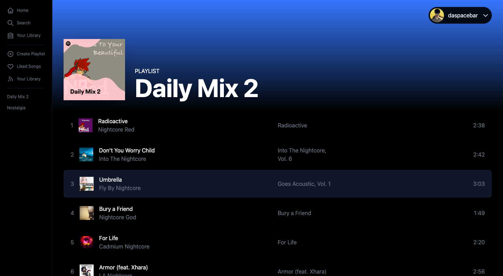

# Spotify Clone (kinda :P)

## About the Application

Heard of Spotify? Must have! This is a clone-kinda application same as spotify which basically retrieves data (such as playlists, songs, etc..) from the logged in user's profile using Spotify's Web API. No biggie, just something I wanted to try with Tailwind-CSS and NextJs over a few weekends.

## What's different?

Have used [Recoil](https://recoiljs.org/docs/introduction/getting-started/) for the state and value manager instead of typical useState in react.

Tailwind CSS for time-saving and hectic frontend work. (Yes, I'm lazy), which basically allows you to prevent writing media queries for different screen sizes and some really cool responsiveness of every possible detail.

## Wanna try this on your system?

1. Clone this Repo: `git clone https://github.com/daspacebar/SpotifyClone.git`

2. Install packages `yarn install or npm install`

3. Go to your [Spotify Developer](https://developer.spotify.com/dashboard/applications) and copy your CLIENT SECRET AND CLIENT ID to your clipboard and paste it in environment variable file.

4. Create a file `.env.local` and follow the `.env.example` for inserting keys and secrets from your spotify developer's profile.

5. That's it, now run the project with `yarn run dev or npm run dev`

## Screenshots and live previews

[Live preview](https://spotify-clone-daspacebar.vercel.app)

Some WIP! Peace!
